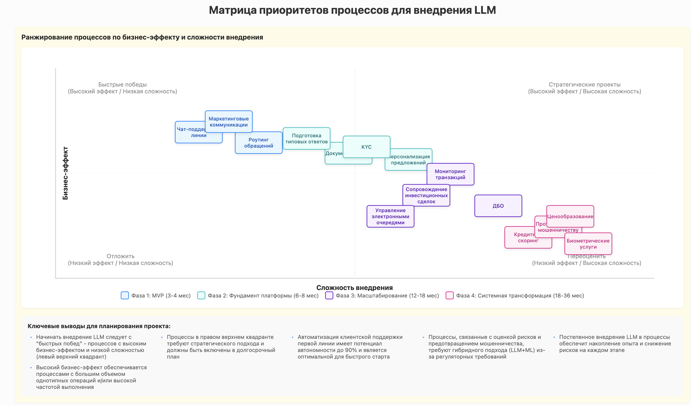
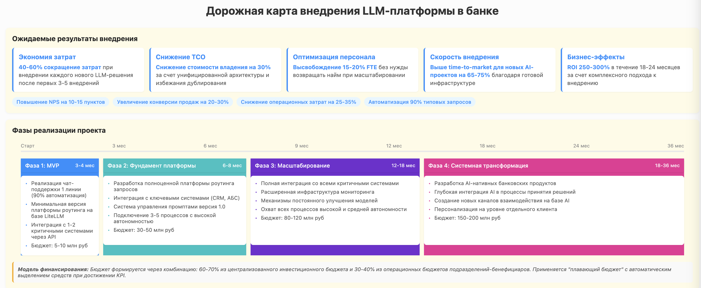
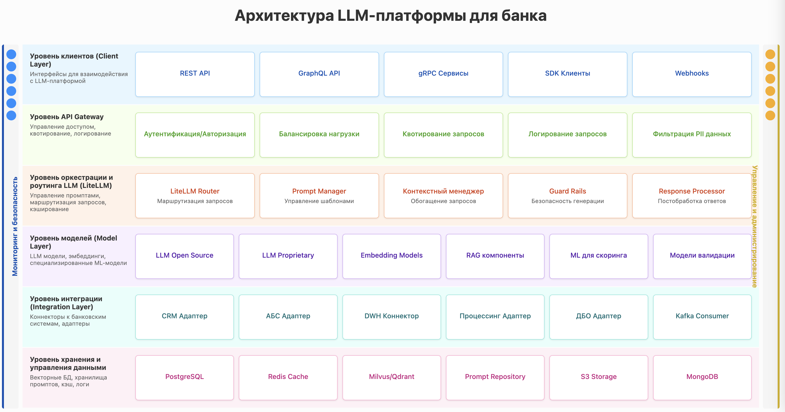
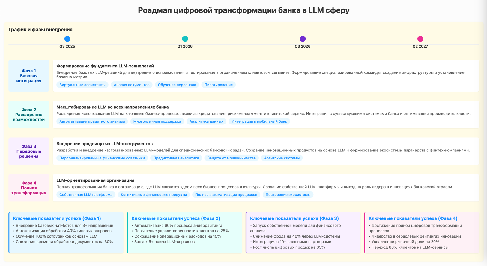

# LLM-Generated Presentation Slides

This repository contains HTML slides generated using Claude-3.7-sonnet with a specialized system prompt. The prompt is designed to maintain consistent styling and generate horizontal slides suitable for presentations.

## Example Slides

### LLM Priority Matrix


### Compact LLM Roadmap


### Additional Examples

We have more specialized examples in the simple_example directory:

#### LLM Architecture for Banking


This slide visualizes a comprehensive architecture for implementing LLM technology in a banking environment, with clearly defined layers and components.

#### Bank LLM Transformation Roadmap


This slide presents a phased approach to digital transformation for banks implementing LLM technologies, with timelines and key milestones.

## About This Project

These slides were created using Claude-3.7-sonnet with a specialized system prompt that ensures:

- Consistent styling across all slides
- Responsive layout with appropriate spacing
- Clear visual hierarchy and information organization
- Horizontal presentation format

The system includes baseline examples and considerations for the initial phase of digital transformation. The prompt maintains style consistency while allowing for flexibility in content generation.

## System Prompt

The full system prompt used for generation can be found in the [prompt_slide_claude.md](prompt_slide_claude.md) file in this repository.

## Sample Prompts for Generation

### For LLM Architecture Slide:
```
Create a detailed architectural diagram for a bank's LLM platform. Include client-facing layers, API/orchestration layers, model layers, integration layers, and storage layers. Also include cross-cutting concerns like monitoring/security and management. Use a vertical layout that clearly shows the different layers and their relationships.
```

### For Bank LLM Transformation Roadmap:
```
Design a roadmap slide for a bank's digital transformation into LLM technologies. Include 4 phases with timelines from Q3 2025 to Q2 2027, key milestones, and major initiatives for each phase. Focus on the progression from basic integration to advanced AI-driven banking services.
```

## Repository

This project is hosted on GitHub: [https://github.com/kekslop/presentation_claude_prompt](https://github.com/kekslop/presentation_claude_prompt) 
